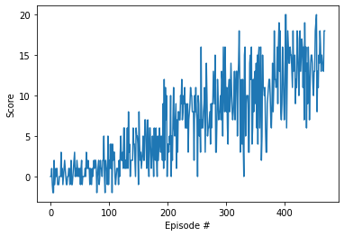

[Udacity Deep Reinforcement Learning Nanodegree](https://www.udacity.com/course/deep-reinforcement-learning-nanodegree--nd893)
# Project 1: Navigation

The idea for this project is to train a Deep Reinforcement Learning agent to learn, by interacting with the environment, how to collect bananas and avoid blue bananas, as they yield +1 and -1 rewards respectively.

For solving this environment, the training of the agent must have a 13 score average, for 100 episodes window. 

The algorithm used to implement the DQN(Deep Q Network) uses the following hyperparameters:
    
    - BUFFER_SIZE = 100000
    - BATCH_SIZE = 16
    - GAMMA = 0.99
    - TAU = 0.001
    - LR = 0.0005
    - UPDATE_EVERY = 4

Several combinations have been tried, and using a lower LR(learning rate) and a smaller batch size seemed to stabilize the local network.

The agent's neural network has the following architecture:

    Input layer = state_size = 37
        ReLu Activation
    Dense layer 128
        ReLu Activation
        Dropout 10%
    Dense layer 64
        ReLu Activation
    Output Layer = action_size = 4

Using these parameters and neural network, the trained agent was able to solve the environment (average of 13 in a window of 100 episodes) in 
469 episodes, as shown in the plot of rewards below.

When running some simulations with the trained agent, some episodes the agent seems to get stucked and prefers to not go for new rewards and stays with a score around 5. One way to improve that is adding a negative small reward (.5) each step, so the agent would not stay in the same place. 

Other things that could be implemented (like the Rainbow features) could help in the training time and make it more stable on simulations.